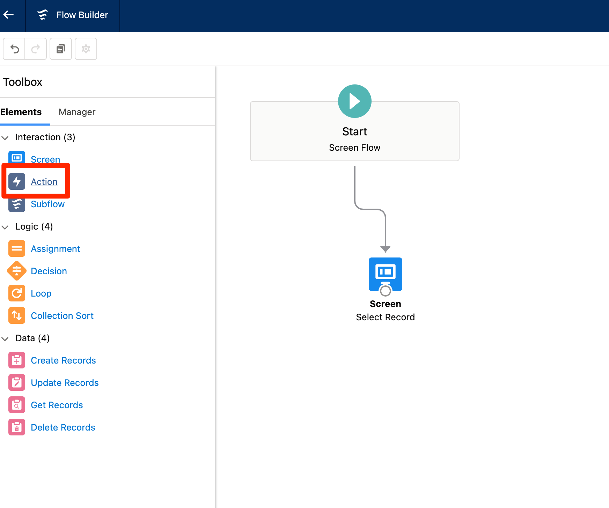
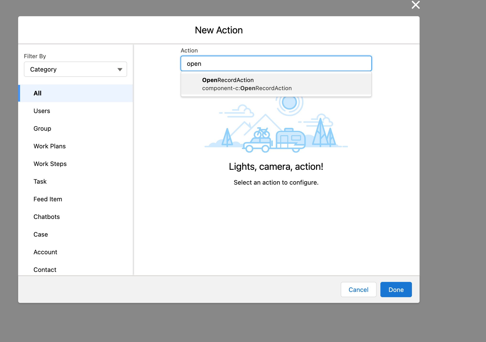

# Open Record Flow Action

Version 0.1

A Flow Action that can be added to Flows to open a record's detail page from a screen flow. Works in Standard Apps as well as Console Apps. Console Apps can set the detail page to be opened and set as the focus or open in the background

## Options to Install

1. Install the unmanaged package by clicking the link to be taken to the latest release for the package: [Install Unmanaged Package](https://login.salesforce.com/packaging/installPackage.apexp?p0=04t5G000004C4hJQAS)
2. Install the components without installing the package by clicking the button below. Be aware that installing will override any components that share the same name!

  

## Examples of How to Use the Flow Action

1. **In a screen flow, drag the Action to the page to add the Flow Action**

2. **Search for the Flow Action, named `OpenRecordAction`**

3. **The Required Inputs depend on the App the Screenflow is used in**

To use the screenflow in either context, it's recommended to populate all the input values

| Input Field | Description | Standard | Console |
| ------ | ----------------- | ----- | ----- |
| RecordId | The ID of the Record to open | x | x |
| Focus | True/False as to whether the detail page opens in focus | | x |
| Object API Name | The API Name of the Record's Object | x | |
| View or Edit? | Whether the detail page opens in View or Edit mode | x | |

## Package Updating or Upgrading

UnofficialSF has a great tips/tricks page on this and it's recommended that you are looking at that and following the steps there before updating the newest version
- [TIPS & TRICKS – UPDATE/UPGRADE AN UNMANAGED PACKAGE](https://unofficialsf.com/tips-tricks-update-upgrade-an-unmanaged-package/)