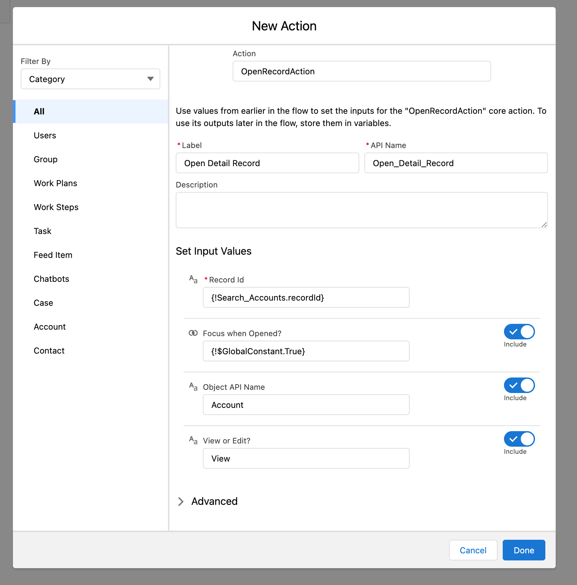

# Open Record Flow Action

Version 0.1

A Flow Action that can be added to Flows to open a record's detail page from a screen flow. Works in Standard Apps as well as Console Apps. Console Apps can set the detail page to be opened and set as the focus or open in the background
## Options to Install

- [Install Unmanaged Package](https://login.salesforce.com/packaging/installPackage.apexp?p0=04t5w000005qw6WAAQ)
  - password is `wmpgowest`
- [Deploy Component Source (*need WMP GitHub access)](https://githubsfdeploy.herokuapp.com?owner=wmpcx&repo=open-record-flow-action&ref=main)

## Examples of How to Use the Flow Action

### In a screen flow, drag the Action to the page to add the Flow Action

### Search for the Flow Action, named `OpenRecordAction`

### The Required Inputs depend on the App the Screenflow is used in

- To use the screenflow in either context, it's recommended to populate all the input values
- Specifically for
  - Standard Apps, fields required are
    - RecordId
    - View or Edit?
    - Object API Name
  - Console Apps, fields required are
    - RecordId
    - Focus (does defaults to False if left blank)

## Package Updating or Upgrading

UnofficialSF has a great tips/tricks page on this and it's recommended that you are looking at that and following the steps there before updating the newest version
- [TIPS & TRICKS – UPDATE/UPGRADE AN UNMANAGED PACKAGE](https://unofficialsf.com/tips-tricks-update-upgrade-an-unmanaged-package/)